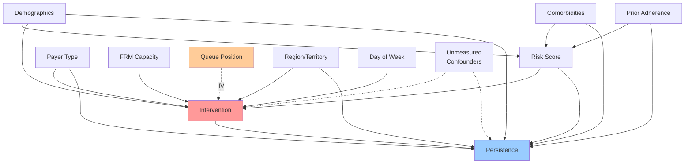

# Specialty Pharmacy Incrementality Study Design
## Measuring Causal Impact Without Denying Care

---

## Executive Summary

This document outlines a comprehensive study design to measure the incremental causal effect of FRM/RSM interventions on patient persistence and adherence to specialty medications. The design employs state-of-the-art causal inference methods while respecting the ethical constraint of not denying care to any patient.

### Key Features:
- **Primary Method**: Doubly-robust observational design (AIPW/IPTW)
- **Enhancements**: Multiple quasi-experimental approaches for stronger identification
- **Target Population**: Patients on specialty medications with predictive risk scores
- **Primary Outcome**: 6-month persistence on therapy
- **Key Innovation**: Combining observational and quasi-experimental methods without care denial

---

## 1. Study Overview & Causal Framework

### 1.1 Research Questions
1. **Primary**: What is the causal effect of FRM/RSM interventions on 6-month medication persistence?
2. **Secondary**:
   - How does intervention effectiveness vary by patient risk profile?
   - What is the optimal intervention intensity (dose-response)?
   - Which patient subgroups benefit most from interventions?

### 1.2 Directed Acyclic Graph (DAG)



### 1.3 Identification Strategy

**Primary Approach**: Conditional independence assumption with rich covariates
- Control for all observed confounders via propensity score methods
- Double robustness via outcome modeling

**Supporting Approaches**: Quasi-experimental designs exploiting:
- Temporal variation (stepped-wedge)
- Queue randomization
- Threshold discontinuities
- Instrumental variables

---

## 2. Primary Observational Study Design

### 2.1 Treatment Definition

**Primary Definition**:
```
Treatment (T) = 1 if patient received qualifying intervention within 7 days of first high-risk flag
               = 0 if patient flagged as high-risk but no intervention within 7 days
```

**Qualifying Interventions**:
- Direct patient contact (phone call completed)
- Text message engagement (response received)
- Benefit verification assistance
- Educational materials sent with confirmation of receipt

**Sensitivity Analyses**:
- Narrow window: 0-3 days
- Wide window: 0-14 days
- Intensity levels: None, Light (1 touch), Medium (2-3 touches), Heavy (4+ touches)

### 2.2 Temporal Alignment

```
Timeline:
|--Pre-period--|--Flag (t0)--|--Treatment Window--|--Washout--|--Outcome Window--|
   (-180 to -1)    (Day 0)        (Days 0-7)        (Days 8-30)   (Days 31-210)
```

**Key Rules**:
1. t0 = First high-risk flag date
2. All covariates measured pre-t0 (no look-ahead bias)
3. 30-day washout to ensure treatment precedes outcome
4. 6-month follow-up for primary outcome

### 2.3 Propensity Score Model

**Specification**:
```python
# Propensity model for treatment assignment
ps_formula = """
    treatment ~ risk_score + risk_score_squared +
                age + gender + payer_type +
                prior_adherence_pdc + prior_discontinuation +
                comorbidity_index + specialty_drug_class +
                prescriber_volume + prescriber_specialty +
                frm_caseload + frm_experience +
                territory_backlog + day_of_week +
                month_of_year + model_version +
                region + urban_rural +
                copay_amount + prior_benefit_checks +
                days_since_therapy_start +
                prior_hospitalizations + er_visits
"""
```

**Estimation Methods**:
1. Logistic regression (primary)
2. Gradient Boosting Machine (sensitivity)
3. Super Learner ensemble (robustness check)

### 2.4 Weighting Strategy

**Primary**: Inverse Probability of Treatment Weighting (IPTW)
```python
# IPTW weights
weight_treated = 1 / ps
weight_control = 1 / (1 - ps)

# Stabilized weights
sw_treated = P(T=1) / ps
sw_control = P(T=0) / (1 - ps)
```

**Alternative**: Overlap Weights (for better balance)
```python
overlap_weight = ps * (1 - ps)
```

### 2.5 Outcome Models

**Binary Outcome (6-month persistence)**:
```python
# Doubly-robust AIPW estimator
outcome_model = """
    persistence_6m ~ treatment + risk_score + age +
                     payer_type + prior_adherence_pdc +
                     comorbidity_index + specialty_drug_class
"""

# Weighted regression
weighted_glm(outcome_model, weights=iptw_weights, family=binomial)
```

**Time-to-Event (Discontinuation)**:
```python
# Weighted Cox proportional hazards
coxph(Surv(time_to_discontinuation, event) ~ treatment + covariates,
      weights=iptw_weights)
```

### 2.6 Balance Assessment

**Metrics**:
- Standardized Mean Differences (SMD < 0.1 threshold)
- Variance Ratios (0.5 < VR < 2.0)
- Kolmogorov-Smirnov statistics
- Propensity score overlap plots

---

## 3. Quasi-Experimental Enhancements

### 3.1 Stepped-Wedge Design

**Implementation**:
```
Territory Rollout Schedule:
Month 1: Territories A, B, C receive enhanced protocol
Month 2: Add Territories D, E, F
Month 3: Add Territories G, H, I
Month 4: All territories on enhanced protocol

Control: Pre-rollout period for each territory
Treatment: Post-rollout period for each territory
```

**Analysis**:
```python
# Difference-in-differences with staggered adoption
did_model = """
    outcome ~ territory + month +
              territory:post_treatment +
              patient_covariates
"""

# Event study specification
event_study = """
    outcome ~ territory + month +
              Σ(territory × relative_time_indicators) +
              patient_covariates
"""
```

### 3.2 Priority Queue Randomization

**Design**:
- Among patients flagged on the same day with similar risk scores
- Randomize contact order while ensuring all receive intervention
- Compare early vs. late contact within narrow windows

**Implementation**:
```python
# Within each risk_score × date cell
queue_position = random_uniform(0, 1)
treatment_timing = rank(queue_position)

# Instrument: randomized queue position
# Treatment: early_contact (top quartile of queue)
# Comparison: late_contact (bottom quartile of queue)
```

### 3.3 Regression Discontinuity Design

**Threshold-Based Outreach**:
```python
# If risk_score threshold exists at 0.7
treatment_probability = {
    1.0 if risk_score >= 0.7
    0.2 if risk_score < 0.7
}

# RD estimation around threshold
rd_estimate = lim[h→0] {E[Y|score=0.7+h] - E[Y|score=0.7-h]}
```

**Regression Kink Design** (if intervention intensity changes):
```python
# Intensity function with kink at threshold
intervention_intensity = {
    high_intensity if risk_score >= 0.7
    low_intensity if risk_score < 0.7
}
```

### 3.4 Instrumental Variables Approach

**Instruments**:
1. **FRM Leave**: Unexpected FRM absence (PTO, sick leave)
2. **Capacity Shocks**: Sudden volume changes in territory
3. **System Downtime**: Technical issues affecting outreach capability
4. **Day-of-Week Effects**: Monday vs. Friday assignment patterns

**2SLS Estimation**:
```python
# First stage: Predict treatment
first_stage = """
    treatment ~ frm_on_leave + capacity_shock +
                system_downtime + monday_flag +
                all_confounders
"""

# Second stage: Outcome on predicted treatment
second_stage = """
    outcome ~ predicted_treatment + all_confounders
"""
```

---

## 4. Data Specification

### 4.1 Core Tables Structure

```sql
-- Patient Master Table
CREATE TABLE patient_master (
    patient_id VARCHAR(50) PRIMARY KEY,
    index_date DATE,
    specialty_drug VARCHAR(100),
    drug_class VARCHAR(50),
    age_at_index INT,
    gender VARCHAR(10),
    payer_type VARCHAR(50),
    payer_subtype VARCHAR(50),
    region VARCHAR(50),
    urban_rural VARCHAR(20),
    prescriber_id VARCHAR(50),
    hub_id VARCHAR(50)
);

-- Risk Scores Table
CREATE TABLE risk_scores (
    score_id INT PRIMARY KEY,
    patient_id VARCHAR(50),
    score_date DATE,
    risk_score DECIMAL(4,3),
    model_version VARCHAR(20),
    risk_factors JSON,
    threshold_flag BOOLEAN,
    priority_level VARCHAR(20),
    INDEX idx_patient_date (patient_id, score_date)
);

-- Interventions Table
CREATE TABLE interventions (
    intervention_id INT PRIMARY KEY,
    patient_id VARCHAR(50),
    intervention_date DATETIME,
    intervention_type VARCHAR(50),
    channel VARCHAR(50),
    frm_id VARCHAR(50),
    attempt_number INT,
    success_flag BOOLEAN,
    engagement_score INT,
    duration_minutes INT,
    content_tags JSON,
    INDEX idx_patient_date (patient_id, intervention_date)
);

-- Outcomes Table
CREATE TABLE outcomes (
    patient_id VARCHAR(50) PRIMARY KEY,
    discontinuation_date DATE,
    discontinuation_reason VARCHAR(100),
    last_fill_date DATE,
    refill_count INT,
    pdc_6month DECIMAL(4,3),
    pdc_12month DECIMAL(4,3),
    mpr_6month DECIMAL(4,3),
    persistence_6month BOOLEAN,
    persistence_12month BOOLEAN,
    time_to_discontinuation INT
);

-- Operational Context Table
CREATE TABLE operational_context (
    date DATE,
    frm_id VARCHAR(50),
    territory VARCHAR(50),
    caseload INT,
    capacity_utilization DECIMAL(4,3),
    backlog_count INT,
    frm_on_leave BOOLEAN,
    system_availability BOOLEAN,
    PRIMARY KEY (date, frm_id)
);
```

### 4.2 Cohort Construction SQL

```sql
-- Main analysis cohort
WITH first_high_risk AS (
    SELECT
        patient_id,
        MIN(score_date) as first_flag_date
    FROM risk_scores
    WHERE risk_score >= 0.5  -- High risk threshold
        AND score_date BETWEEN '2024-01-01' AND '2024-06-30'
    GROUP BY patient_id
),

treatment_window AS (
    SELECT
        f.patient_id,
        f.first_flag_date,
        CASE
            WHEN EXISTS (
                SELECT 1 FROM interventions i
                WHERE i.patient_id = f.patient_id
                    AND i.intervention_date BETWEEN f.first_flag_date
                        AND DATE_ADD(f.first_flag_date, INTERVAL 7 DAY)
                    AND i.success_flag = TRUE
            ) THEN 1
            ELSE 0
        END as treatment
    FROM first_high_risk f
),

baseline_covariates AS (
    SELECT
        p.patient_id,
        p.age_at_index,
        p.gender,
        p.payer_type,
        p.region,
        -- Prior adherence from 6 months before flag
        (SELECT AVG(pdc) FROM adherence_history ah
         WHERE ah.patient_id = p.patient_id
            AND ah.month_date BETWEEN DATE_SUB(t.first_flag_date, INTERVAL 180 DAY)
                AND DATE_SUB(t.first_flag_date, INTERVAL 1 DAY)
        ) as prior_pdc,
        -- Comorbidity burden
        (SELECT COUNT(DISTINCT diagnosis_code) FROM diagnoses d
         WHERE d.patient_id = p.patient_id
            AND d.diagnosis_date < t.first_flag_date
        ) as comorbidity_count
    FROM patient_master p
    JOIN treatment_window t ON p.patient_id = t.patient_id
)

SELECT
    t.*,
    b.*,
    o.persistence_6month,
    o.time_to_discontinuation,
    o.pdc_6month
FROM treatment_window t
JOIN baseline_covariates b ON t.patient_id = b.patient_id
JOIN outcomes o ON t.patient_id = o.patient_id
WHERE
    -- Ensure adequate follow-up
    DATE_ADD(t.first_flag_date, INTERVAL 210 DAY) <= CURRENT_DATE;
```

---

## 5. Statistical Analysis Plan

### 5.1 Primary Analysis: AIPW Estimator

```python
import numpy as np
import pandas as pd
from sklearn.linear_model import LogisticRegression
from sklearn.ensemble import GradientBoostingClassifier
import statsmodels.api as sm
from scipy import stats

class DoublyRobustEstimator:
    """
    Augmented Inverse Probability Weighted (AIPW) Estimator
    for Average Treatment Effect on the Treated (ATT)
    """

    def __init__(self, outcome_model='logistic', ps_model='logistic'):
        self.outcome_model_type = outcome_model
        self.ps_model_type = ps_model

    def fit(self, X, treatment, outcome):
        """
        Fit propensity score and outcome models
        """
        # Fit propensity score model
        if self.ps_model_type == 'logistic':
            self.ps_model = LogisticRegression(max_iter=1000)
        elif self.ps_model_type == 'gbm':
            self.ps_model = GradientBoostingClassifier(n_estimators=100)

        self.ps_model.fit(X, treatment)
        self.propensity_scores = self.ps_model.predict_proba(X)[:, 1]

        # Fit outcome models for treated and control
        X_treated = X[treatment == 1]
        Y_treated = outcome[treatment == 1]
        X_control = X[treatment == 0]
        Y_control = outcome[treatment == 0]

        self.outcome_model_1 = LogisticRegression(max_iter=1000)
        self.outcome_model_1.fit(X_treated, Y_treated)

        self.outcome_model_0 = LogisticRegression(max_iter=1000)
        self.outcome_model_0.fit(X_control, Y_control)

        # Predict potential outcomes
        self.mu_1 = self.outcome_model_1.predict_proba(X)[:, 1]
        self.mu_0 = self.outcome_model_0.predict_proba(X)[:, 1]

    def estimate_att(self, treatment, outcome):
        """
        Calculate ATT using AIPW estimator
        """
        n = len(treatment)
        ps = self.propensity_scores

        # AIPW components
        ipw_component = (treatment * outcome / ps -
                        (1 - treatment) * outcome / (1 - ps))

        augmentation = ((treatment - ps) *
                       (self.mu_1 - self.mu_0) / ps)

        # ATT estimate
        att = np.mean(ipw_component + augmentation)

        # Bootstrap standard error
        att_bootstrap = []
        for _ in range(1000):
            idx = np.random.choice(n, n, replace=True)
            boot_ipw = ipw_component[idx]
            boot_aug = augmentation[idx]
            att_bootstrap.append(np.mean(boot_ipw + boot_aug))

        se = np.std(att_bootstrap)
        ci_lower = np.percentile(att_bootstrap, 2.5)
        ci_upper = np.percentile(att_bootstrap, 97.5)

        return {
            'att': att,
            'se': se,
            'ci_lower': ci_lower,
            'ci_upper': ci_upper,
            'p_value': 2 * (1 - stats.norm.cdf(abs(att / se)))
        }

    def check_balance(self, X, treatment):
        """
        Assess covariate balance after weighting
        """
        weights_treated = treatment / self.propensity_scores
        weights_control = (1 - treatment) / (1 - self.propensity_scores)

        balance_results = []
        for col in range(X.shape[1]):
            # Weighted means
            mean_treated = np.average(X[treatment == 1, col],
                                     weights=weights_treated[treatment == 1])
            mean_control = np.average(X[treatment == 0, col],
                                     weights=weights_control[treatment == 0])

            # Weighted standard deviations
            var_treated = np.average((X[treatment == 1, col] - mean_treated)**2,
                                    weights=weights_treated[treatment == 1])
            var_control = np.average((X[treatment == 0, col] - mean_control)**2,
                                    weights=weights_control[treatment == 0])

            pooled_sd = np.sqrt((var_treated + var_control) / 2)

            # Standardized mean difference
            smd = (mean_treated - mean_control) / pooled_sd if pooled_sd > 0 else 0

            balance_results.append({
                'variable': f'X{col}',
                'smd': smd,
                'balanced': abs(smd) < 0.1
            })

        return pd.DataFrame(balance_results)
```

### 5.2 Heterogeneous Treatment Effects

```python
from sklearn.ensemble import RandomForestRegressor
from econml.dml import CausalForestDML

class HeterogeneousEffectAnalyzer:
    """
    Estimate Conditional Average Treatment Effects (CATE)
    using Causal Forests
    """

    def __init__(self):
        self.model = CausalForestDML(
            model_y=RandomForestRegressor(n_estimators=100),
            model_t=RandomForestRegressor(n_estimators=100),
            n_estimators=1000,
            min_samples_leaf=10,
            max_depth=None,
            random_state=42
        )

    def fit_and_predict(self, X, treatment, outcome, X_test=None):
        """
        Fit causal forest and predict CATE
        """
        self.model.fit(Y=outcome, T=treatment, X=X)

        if X_test is None:
            X_test = X

        # Point estimates and confidence intervals
        cate_estimates = self.model.effect(X_test)
        cate_lower, cate_upper = self.model.effect_interval(X_test)

        return {
            'cate': cate_estimates,
            'ci_lower': cate_lower,
            'ci_upper': cate_upper
        }

    def compute_uplift_curves(self, cate_estimates, outcome, treatment):
        """
        Generate Qini and uplift curves for model evaluation
        """
        n = len(cate_estimates)

        # Sort by predicted CATE (descending)
        sorted_idx = np.argsort(-cate_estimates)

        qini_curve = []
        uplift_curve = []

        for k in range(1, n + 1):
            top_k_idx = sorted_idx[:k]

            # Outcomes in top k
            treated_outcome = outcome[top_k_idx][treatment[top_k_idx] == 1].mean()
            control_outcome = outcome[top_k_idx][treatment[top_k_idx] == 0].mean()

            n_treated = (treatment[top_k_idx] == 1).sum()
            n_control = (treatment[top_k_idx] == 0).sum()

            # Qini coefficient
            qini = n_treated * treated_outcome - n_control * control_outcome
            qini_curve.append(qini)

            # Uplift
            if n_treated > 0 and n_control > 0:
                uplift = treated_outcome - control_outcome
            else:
                uplift = 0
            uplift_curve.append(uplift)

        return {
            'qini_curve': np.array(qini_curve),
            'uplift_curve': np.array(uplift_curve),
            'percentiles': np.arange(1, n + 1) / n * 100
        }
```

### 5.3 Sensitivity Analysis

```python
class SensitivityAnalysis:
    """
    Rosenbaum bounds and E-value calculations
    for unmeasured confounding
    """

    @staticmethod
    def rosenbaum_bounds(treatment_effect, se, gamma_range=(1, 3)):
        """
        Calculate Rosenbaum bounds for hidden bias
        """
        gammas = np.linspace(gamma_range[0], gamma_range[1], 20)
        p_values = []

        for gamma in gammas:
            # Worst-case bounds under hidden bias of magnitude gamma
            z_score = treatment_effect / (se * np.sqrt(gamma))
            p_val = 2 * (1 - stats.norm.cdf(abs(z_score)))
            p_values.append(p_val)

        return pd.DataFrame({
            'gamma': gammas,
            'p_value': p_values,
            'significant': [p < 0.05 for p in p_values]
        })

    @staticmethod
    def e_value(estimate, ci_lower):
        """
        Calculate E-value for unmeasured confounding
        """
        # Convert to risk ratio scale if needed
        rr_estimate = np.exp(estimate)
        rr_ci_lower = np.exp(ci_lower)

        # E-value for point estimate
        e_value_est = rr_estimate + np.sqrt(rr_estimate * (rr_estimate - 1))

        # E-value for confidence interval
        if rr_ci_lower > 1:
            e_value_ci = rr_ci_lower + np.sqrt(rr_ci_lower * (rr_ci_lower - 1))
        else:
            e_value_ci = 1

        return {
            'e_value_estimate': e_value_est,
            'e_value_ci': e_value_ci,
            'interpretation': f"Unmeasured confounder would need RR >= {e_value_ci:.2f} to explain away the effect"
        }
```

---

## 6. Reporting Templates

### 6.1 Executive Summary Dashboard

```python
def create_executive_summary(results):
    """
    Generate executive summary of incrementality results
    """

    summary = f"""
    INCREMENTALITY STUDY RESULTS
    =============================

    Primary Finding:
    ----------------
    • Intervention Effect (ATT): {results['att']:.1%} improvement in 6-month persistence
    • 95% CI: [{results['ci_lower']:.1%}, {results['ci_upper']:.1%}]
    • Statistical Significance: {"Yes" if results['p_value'] < 0.05 else "No"} (p={results['p_value']:.3f})

    Clinical Impact:
    ---------------
    • NNT (Number Needed to Treat): {results['nnt']:.0f} patients
    • Avoided Discontinuations per 100 interventions: {results['avoided_per_100']:.1f}
    • Median Days of Therapy Extended: {results['days_extended']:.0f}

    Business Value:
    --------------
    • Incremental Revenue per Intervention: ${results['revenue_per_intervention']:,.0f}
    • ROI: {results['roi']:.0%}
    • Annual Impact (projected): ${results['annual_impact']:,.0f}

    Highest Impact Segments:
    ------------------------
    1. {results['top_segment_1']}: {results['effect_1']:.1%} lift
    2. {results['top_segment_2']}: {results['effect_2']:.1%} lift
    3. {results['top_segment_3']}: {results['effect_3']:.1%} lift

    Robustness:
    ----------
    • E-value: {results['e_value']:.2f} (hidden bias needed to nullify)
    • Balance achieved: {results['balanced_covariates']}/{results['total_covariates']} variables
    • Multiple methods agree: {"Yes" if results['methods_agree'] else "Mixed"}
    """

    return summary
```

### 6.2 Detailed Results Tables

```python
def generate_subgroup_table(subgroup_results):
    """
    Create formatted subgroup analysis table
    """

    table_data = []
    for subgroup in subgroup_results:
        table_data.append({
            'Subgroup': subgroup['name'],
            'N Treated': subgroup['n_treated'],
            'N Control': subgroup['n_control'],
            'ATT (%)': f"{subgroup['att']*100:.1f}",
            '95% CI': f"[{subgroup['ci_lower']*100:.1f}, {subgroup['ci_upper']*100:.1f}]",
            'P-value': f"{subgroup['p_value']:.3f}",
            'NNT': f"{subgroup['nnt']:.0f}" if subgroup['nnt'] else "N/A"
        })

    return pd.DataFrame(table_data)
```

### 6.3 Visualization Templates

```python
import matplotlib.pyplot as plt
import seaborn as sns

def create_visualization_suite(results):
    """
    Generate standard visualization package
    """

    fig, axes = plt.subplots(2, 3, figsize=(15, 10))

    # 1. Propensity Score Overlap
    ax = axes[0, 0]
    ax.hist(results['ps_treated'], alpha=0.5, label='Treated', bins=30)
    ax.hist(results['ps_control'], alpha=0.5, label='Control', bins=30)
    ax.set_xlabel('Propensity Score')
    ax.set_title('Propensity Score Distribution')
    ax.legend()

    # 2. Covariate Balance Plot (Love Plot)
    ax = axes[0, 1]
    balance_df = results['balance_df']
    ax.scatter(balance_df['smd_before'], range(len(balance_df)),
              alpha=0.5, label='Before')
    ax.scatter(balance_df['smd_after'], range(len(balance_df)),
              alpha=0.5, label='After')
    ax.axvline(x=-0.1, color='r', linestyle='--', alpha=0.3)
    ax.axvline(x=0.1, color='r', linestyle='--', alpha=0.3)
    ax.set_xlabel('Standardized Mean Difference')
    ax.set_title('Covariate Balance')
    ax.legend()

    # 3. Treatment Effect by Risk Score
    ax = axes[0, 2]
    risk_bins = results['risk_score_bins']
    effects = results['effects_by_risk']
    ci_lower = results['effects_ci_lower']
    ci_upper = results['effects_ci_upper']

    ax.plot(risk_bins, effects, 'o-')
    ax.fill_between(risk_bins, ci_lower, ci_upper, alpha=0.3)
    ax.set_xlabel('Risk Score Decile')
    ax.set_ylabel('Treatment Effect')
    ax.set_title('Heterogeneous Treatment Effects')

    # 4. Qini Curve
    ax = axes[1, 0]
    ax.plot(results['qini_percentiles'], results['qini_curve'], label='Model')
    ax.plot(results['qini_percentiles'], results['qini_random'],
           label='Random', linestyle='--')
    ax.set_xlabel('Percentage Treated')
    ax.set_ylabel('Qini Coefficient')
    ax.set_title('Qini Curve')
    ax.legend()

    # 5. Kaplan-Meier Curves
    ax = axes[1, 1]
    ax.plot(results['km_time'], results['km_treated'], label='Treated')
    ax.plot(results['km_time'], results['km_control'], label='Control')
    ax.set_xlabel('Days Since Index')
    ax.set_ylabel('Persistence Probability')
    ax.set_title('Kaplan-Meier Persistence Curves')
    ax.legend()

    # 6. ROI by Intervention Intensity
    ax = axes[1, 2]
    intensities = results['intervention_intensities']
    rois = results['roi_by_intensity']

    ax.bar(intensities, rois)
    ax.set_xlabel('Intervention Intensity')
    ax.set_ylabel('ROI (%)')
    ax.set_title('ROI by Intervention Intensity')

    plt.tight_layout()
    return fig
```

---

## 7. Implementation Checklist

### 7.1 Pre-Launch Requirements

- [ ] **Data Infrastructure**
  - [ ] Automated data pipeline for daily updates
  - [ ] Risk score logging with timestamps
  - [ ] Intervention tracking system active
  - [ ] Outcome measurement processes validated

- [ ] **Randomization Infrastructure** (for quasi-experimental)
  - [ ] Queue randomization algorithm implemented
  - [ ] Random seed documentation process
  - [ ] Territory assignment schedule finalized

- [ ] **Operational Alignment**
  - [ ] FRM training on study protocols
  - [ ] Capacity monitoring dashboards live
  - [ ] Escalation procedures documented

### 7.2 During Study

- [ ] **Weekly Monitoring**
  - [ ] Treatment assignment rates
  - [ ] Covariate balance checks
  - [ ] Missing data patterns
  - [ ] Protocol deviations

- [ ] **Monthly Reviews**
  - [ ] Interim power calculations
  - [ ] Safety monitoring
  - [ ] Data quality audits
  - [ ] Operational metrics review

### 7.3 Analysis Phase

- [ ] **Data Preparation**
  - [ ] Cohort locked and documented
  - [ ] Exclusions applied and justified
  - [ ] Missing data imputation completed
  - [ ] Sensitivity cohorts defined

- [ ] **Statistical Analysis**
  - [ ] Primary analysis (AIPW) completed
  - [ ] All pre-specified sensitivity analyses run
  - [ ] Subgroup analyses conducted
  - [ ] Quasi-experimental analyses performed

- [ ] **Validation**
  - [ ] Results replicated by independent analyst
  - [ ] Code review completed
  - [ ] Clinical face validity assessed
  - [ ] Business impact validated

### 7.4 Post-Analysis

- [ ] **Reporting**
  - [ ] Technical report drafted
  - [ ] Executive summary prepared
  - [ ] Visualization package created
  - [ ] Recommendations documented

- [ ] **Operationalization**
  - [ ] Targeting criteria refined based on CATE
  - [ ] Intervention protocols updated
  - [ ] Monitoring dashboard deployed
  - [ ] Training materials developed

---

## 8. Risk Mitigation & Assumptions

### 8.1 Key Assumptions

1. **No Unmeasured Confounding** (for observational design)
   - Mitigation: Rich covariate set including operational variables
   - Validation: Sensitivity analyses (E-value, negative controls)

2. **Positivity/Overlap**
   - Mitigation: Overlap weights, trimming extreme propensities
   - Validation: Common support assessment

3. **SUTVA (Stable Unit Treatment Value Assumption)**
   - Risk: Spillover effects between patients
   - Mitigation: Cluster-robust standard errors

4. **Correct Model Specification**
   - Mitigation: Double robustness, multiple model types
   - Validation: Cross-validation, specification tests

### 8.2 Operational Risks

| Risk | Impact | Mitigation |
|------|--------|------------|
| FRM non-compliance | Selection bias | Training, monitoring, incentives |
| Data quality issues | Invalid estimates | Validation rules, audits |
| Insufficient power | Null findings | Power calculations, extended timeline |
| Technology failures | Missing data | Backup systems, manual capture |
| Ethical concerns | Study suspension | IRB approval, ongoing review |

---

## 9. Appendices

### A. Sample Size Calculations

```python
from statsmodels.stats.power import TTestPower

def calculate_sample_size(effect_size=0.05, alpha=0.05, power=0.8,
                          allocation_ratio=1):
    """
    Calculate required sample size for incrementality study
    """
    power_analysis = TTestPower()
    n = power_analysis.solve_power(
        effect_size=effect_size,
        alpha=alpha,
        power=power,
        ratio=allocation_ratio,
        alternative='two-sided'
    )

    return {
        'n_treatment': int(n),
        'n_control': int(n * allocation_ratio),
        'total_n': int(n * (1 + allocation_ratio))
    }
```

### B. Negative Control Outcomes

Examples for falsification tests:
- Flu vaccination rates (unlikely affected by adherence intervention)
- Laboratory test frequency (for unrelated conditions)
- Primary care visits (not specialty-related)
- Dental claims

### C. Technical Stack Recommendations

- **Data Processing**: Apache Spark / Databricks
- **Statistical Analysis**: R (tidyverse, causalweight, grf) or Python (econml, causalml)
- **Visualization**: Tableau / Power BI for dashboards, ggplot2/matplotlib for reports
- **Version Control**: Git with documented analysis plans
- **Compute**: Cloud platform with sufficient memory for bootstrapping

---

## 10. Timeline & Milestones

| Phase | Duration | Key Activities | Deliverables |
|-------|----------|---------------|--------------|
| Planning | 4 weeks | IRB submission, protocol finalization | Study protocol, DAP |
| Setup | 4 weeks | System configuration, training | Data pipeline, dashboards |
| Enrollment | 6 months | Patient identification, intervention | Weekly reports |
| Follow-up | 6 months | Outcome measurement | Monthly summaries |
| Analysis | 6 weeks | Statistical analysis, validation | Results report |
| Dissemination | 4 weeks | Stakeholder presentations | Final report, recommendations |

---

## Contact & Support

For questions about this study design:
- Statistical Methods: [Biostatistics Team]
- Operational Implementation: [FRM Operations]
- Data Infrastructure: [Data Engineering]
- Clinical Interpretation: [Medical Affairs]

Version: 1.0
Last Updated: 2024
Status: Ready for Implementation